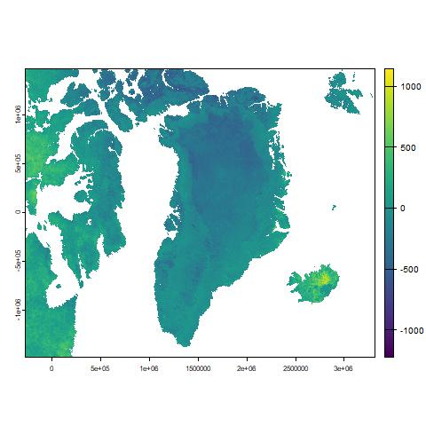

# Reporting multitemporal analysis by Markdown
In order to perform multitemporal analysis, dataset in differt times can be imported, by:
Alt + 96 per creare dei backticks --> apriamo Markdown
``` r
im.list()
gr = im.import("greenland")
```
Once the set has been imported, we can calculate the difference between two different dates, as:
``` r
grdif = gf[[1]] - gf[[4]]
```
The output would be something like:
inseriamo l'immagine usando source, risalendo di un livello usando i "../" per andare dalla cartella Code a quella Pics
 
